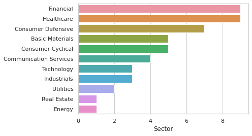
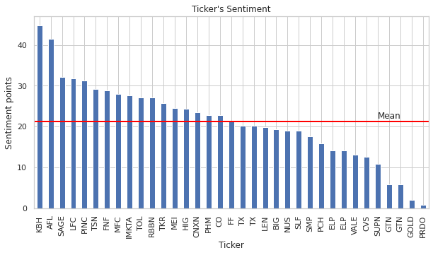
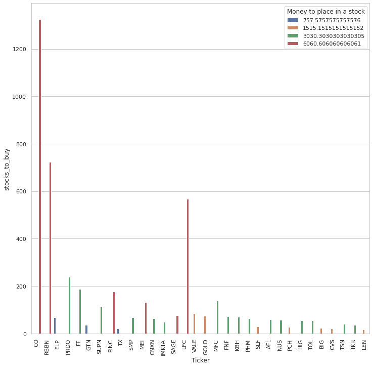

# Long-Term-Portfolio
Project where I acquired data from FinViz, Polygon.io and TradingView in order to check stocks with a growth perspective using simple FinViz' filters.
Then I chose the best ones out of scanned stocks, compared companies with other companies from the same industry and committed a sentiment analysis and completed a portfolio allocation. 

Companies that we analyzed were from the following sectors:

We conducted the sentiment analysis for the stocks to check if the companies have positive news

After we analyzed companies, compared them with their competitors and conducted a sentiment analysis we got a portfolio with a suggested amount of stocks to buy. It is not a financial advice, leverage the acquired insights in your own further analysis.

